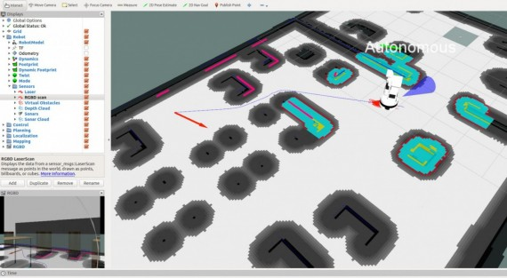
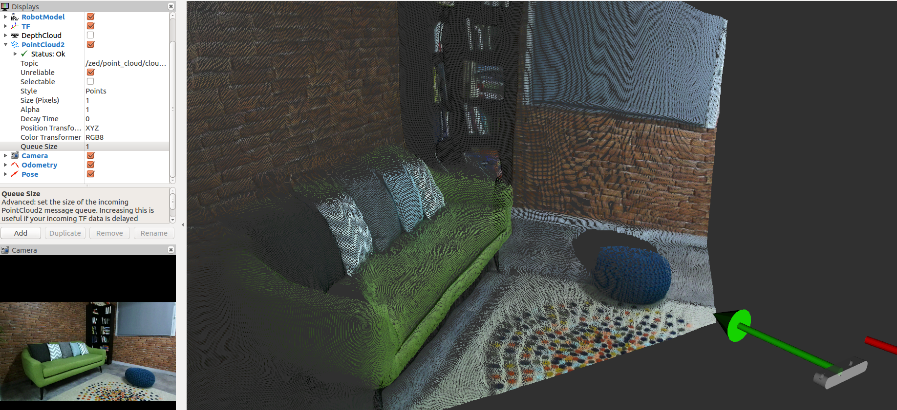

# Desarrollo de test robóticos automáticos en Gazebo
## Descripción
Se pretende desarrollar una plataforma para que se realicen test automáticos en el simulador. Por ejemplo, en un escenario similar a la robocup@AtHome el robot podría seguir a una persona e ir calculando la distancia a ella. Cada vez que modificamos / mejoramos el algoritmo de seguimiento este test se ejecuta en background y al finalizar nos da el resultado.

Esto ayudaría a la detección de bugs, mejoraría el desarrollo y la escalabilidad del código y haría que el software desarrollado fuera más robusto.

En este trabajo se obtendrán conocimientos del funcionamiento de ROS2, se programará en diferentes lenguajes como python y c++ y, lo más importante, se desarrollará una metodología de trabajo basada en test de código y test de funcionamiento que dotarán al alumno de las capacidades de desarrollo de software demandadas por el ámbito científico e industrial.

## Tecnologías que se usarán
* ROS2
* Python
* C++
* Gazebo/Webots
* Turtlebot3/TIAGo

## Tutores
Jonatan Ginés Clavero y Manuel Fernandez Carmona.

  

# ROS2 Course

With the ROS2 release, a new system with much more advanced characteristics is raised and it will be the new standard in robotic software development in the industry.

  

# Navigation Course

The ROS/ROS2 navigation stack is one of its main packages and it allow to give a robot basic capacities of movement in an easy way.

  

# Perception Course

Sensors are a data source very important for robots. Because of them, they can recognize its environment and get information very valious about it.

  

# Deep Learning Course

Deep Learning is one of the most popular areas in the robotics field. Researchs in this area have got awesome results in fields like Natural Language Processing and Computer Vision.

  
